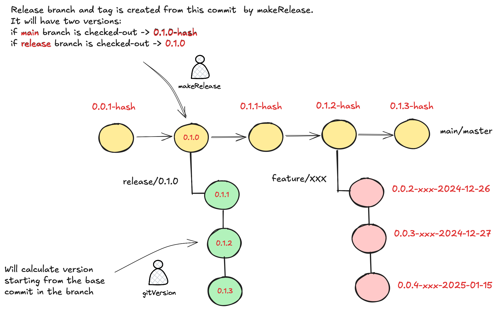

### A simple tool for versioning your JVM app

VerCraft is a [yet another](#why-choose-vercraft) plugin, which **calculates** the current version in SemVer format based on the checked-out commit and applies it to 
build tools and release plugins. It also **makes release preparations** by calculating the next version for the upcoming release, 
creating a new release branch, and tagging the commit with the generated version to reduce manual release work.

## Contribution and Acknowledgement
We will be glad if you will test `VerCraft` or contribute to this project.
In case you don't have much time for this - at least spend 5 seconds to give us a star to attract other contributors! 
**Thanks!** :partying_face: Special thanks to those awesome developers who has given great suggestions for this project: 
[@nulls](https://github.com/nulls), [@semyon-zvyagin](https://github.com/semyon-zvyagin)

## Quick start
No boring configuration, add the following plugin to your **parent** build.gradle(kts):
```kotlin
plugins {
    // when this plugin is applied to parent project, it will automatically calculate and set the version of the project
    id("com.akuleshov7.vercraft.plugin-gradle") version("0.3.0")
}

// (!) Note: If the plugin runs successfully, you will see a log message like this: `>> VerCrafted: 0.0.1`.
```

To create local release tag, local release branch, calculate and return version, run:
```bash
# to create a release branch with a newly calculated MAJOR version
./gradlew makeRelease -PreleaseType=MAJOR

# to create a release branch with a newly calculated MINOR version
./gradlew makeRelease -PreleaseType=MINOR

# (!) Note: `makeRelease` task also pushes release tag and branch to remote git hosting.
```

(Optional) For manual calculation of the version for current checked-out commit, run:
```bash
# this is already done automatically for all projects by plugin,
# but in case you need to do some manual calculations:
./gradlew gitVersion
```

## Supported Build Tools
✅ **Gradle** \
🚧 **Maven** (coming soon)


## How it works
VerCraft automatically calculates the version for your currently checked-out commit. 
It determines the version based solely on two factors: the currently checked-out branch and release branches 
(branches with the release/ prefix) present in your project’s Git log.

If you’re on the main branch, VerCraft identifies the base commit in main that was used to create the latest release branch. 
It then calculates the distance (in commits) from that base commit to your current commit to determine the version.

The same logic applies to commits in release branches. VerCraft locates the first commit in the release branch and calculates the 
distance from that point to the current commit to generate the version.

The only requirement VerCraft imposes is the use of `release/` branches in your delivery process. 
No need for extra tags on every commit or any redundant steps - just clean and efficient version management.



## Why Choose VerCraft
There are already several great tools like `gradle-plugin-versionest`, `reckon`, `JGitver`, and `nebula-release-plugin` 
that calculate project versions based on the current commit and branch. 
Most of these tools rely on tags and offer extensive configurability. **However...**

In practice, these tools often introduce complex configurations without enforcing 
a structured Git workflow—something essential in 80% of enterprise development environments. 
Also other tools are also more useful for a lightweight [Github](https://docs.github.com/en/get-started/using-github/github-flow) flow.

VerCraft takes a different approach:
- **Simplicity over complexity** – Versioning and releasing pipeline based on release branches
is streamlined, familiar to most of the developers in enterprise and easy to adopt.
- **Structured workflow** – VerCraft encourages a straightforward, Git-driven approach to versioning with 
release branches, more similar to Gitlab-flow.

Unlike other tools, VerCraft doesn't treat Git tags as a database for previous releases. 
Instead, it uses **release branches** and some extra heuristics, ensuring that your repository 
remains clean and release processes are strict. 
Only necessary release tags and branches are created — unnecessary "tag zoo" is not made.

## Local Development
Run the following commands for local builds or to publish to your local Maven repository:
```bash
./gradlew build
./gradlew publishToMavenLocal
```

