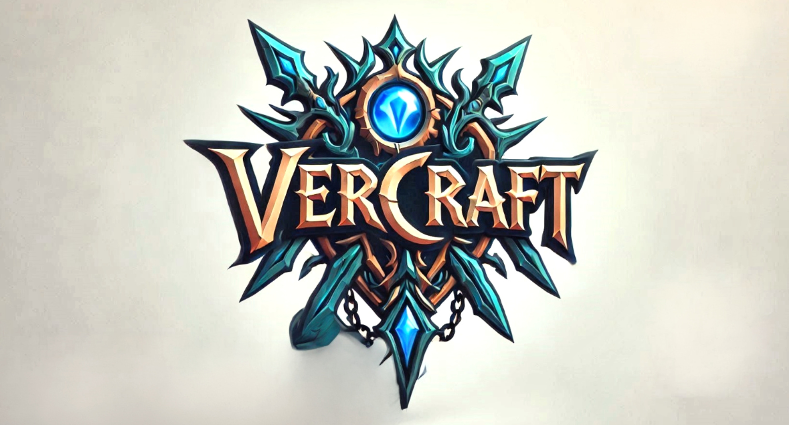

### A simple tool for versioning your JVM app

VerCraft is a plugin, which **calculates** the current version in SemVer format based on the checked-out commit and applies it to 
build tools and release plugins. It also **makes release preparations** by calculating the next version for the upcoming release, 
creating a new release branch, and tagging the commit with the generated version to reduce manual release work.

## Contribution and Acknowledgement
We will be glad if you will test `VerCraft` or contribute to this project.
In case you don't have much time for this - at least spend 5 seconds to give us a star to attract other contributors! 
**Thanks!** :pray: :partying_face:

Special thanks to those awesome developers who give us great suggestions and help us to improve this project:
@nulls, @semyon-zvyagin

### Quick start
Add the following plugin to your **parent** build.gradle(kts):
```kotlin
plugins {
    // when this plugin is applied to parent project, it will automatically calculate and set the version of the project
    id("com.akuleshov7.vercraft.plugin-gradle") version("0.0.2")
}
```

(!) Note: If the plugin runs successfully, you will see a log message like this: `>> VerCrafted: 0.0.1`

To create local release tag, local release branch, calculate and return version, run:
```bash
# to create a release branch with a newly calculated MAJOR version
./gradlew makeRelease -PreleaseType=MAJOR

# to create a release branch with a newly calculated MINOR version
./gradlew makeRelease -PreleaseType=MINOR
```

(!) Note: `makeRelease` task also pushes release tag and branch to remote git hosting.

(Optional) For manual calculation of the version for current checked-out commit, run:
```bash
# this is already done automatically for all projects by plugin,
# but in case you need to do some manual calculations:
./gradlew gitVersion
```

### Supported Build Tools
✅ **Gradle** \
🚧 **Maven** (coming soon)


### How it works


### Why Choose VerCraft?
There are already several great tools like `gradle-plugin-versionest`, `reckon`, `JGitver`, and `nebula-release-plugin` 
that calculate project versions based on the current commit and branch. Most of these tools rely on tags and offer extensive configurability.

**However...**  
In practice, these tools often introduce complex configurations without enforcing 
a structured Git workflow—something essential in 80% of enterprise development environments. 
Also other tools are also more useful for a lightweight [Github](https://docs.github.com/en/get-started/using-github/github-flow) flow.

VerCraft takes a different approach:
- **Simplicity over complexity** – Versioning and releasing pipeline based on release branches
is streamlined, familiar to most of the developers in enterprise and easy to adopt.
- **Structured workflow** – VerCraft encourages a straightforward, Git-driven approach to versioning with 
release branches, more similar to Gitlab-flow.

Unlike other tools, VerCraft doesn't treat Git tags as a database for previous releases. 
Instead, it uses **release branches** and some extra heuristics, ensuring that your repository 
remains clean and release processes are strict. 
Only necessary release tags and branches are created — unnecessary "tag zoo" is not made.

### Local Development
Run the following commands for local builds or to publish to your local Maven repository:
```bash
./gradlew publishToMavenLocal
./gradlew build